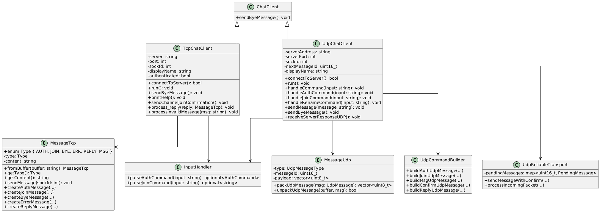
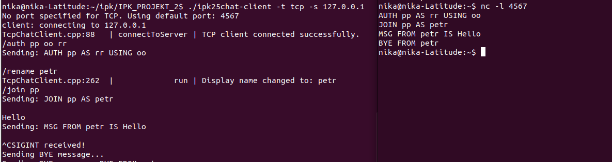
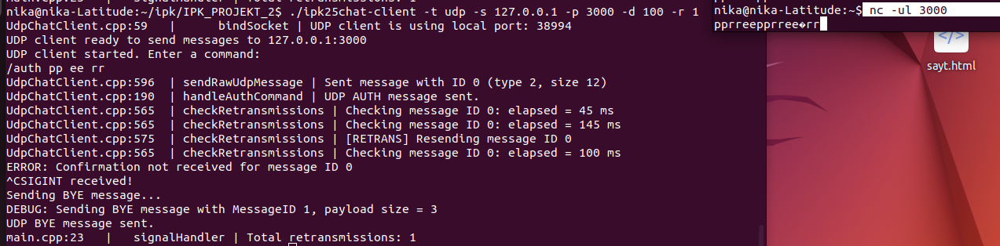
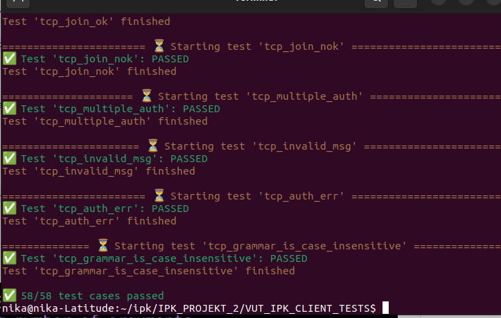
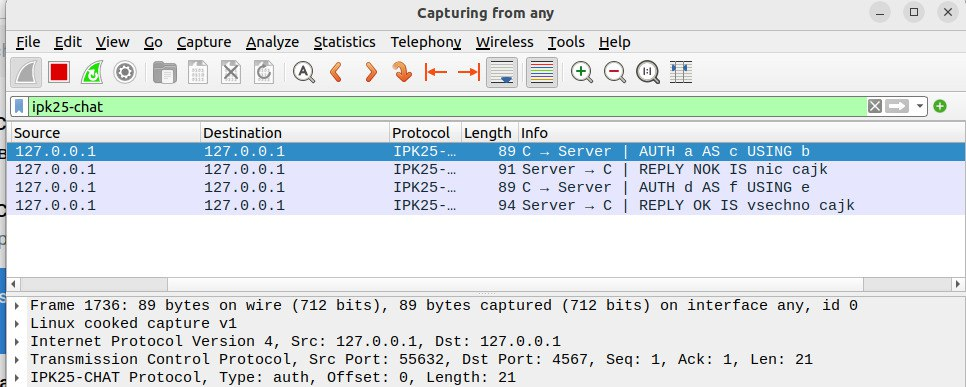
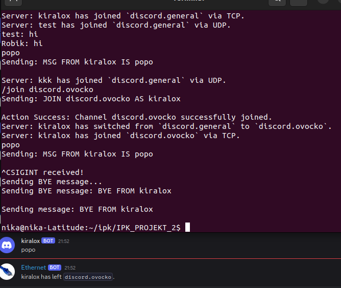

# IPK25-CHAT klient


## Obsah

1. [Teorie](#teorie)
    - [Úvod do TCP a UDP](#úvod-do-tcp-a-udp)
    - [TCP](#tcp)
    - [UDP](#udp)
2. [UML diagramy](#uml-diagramy)
    - [Struktura aplikace](#struktura-aplikace)
3. [Testování](#testování)
4. [Zdroje a použitá literatura](#zdroje-a-použitá-literatura)


---

##  Teorie

### Úvod do TCP a UDP

Pokud chtějí dvě aplikace komunikovat, musí nejdříve navázat spojení. Teprve po jeho navázání
mohou posílat data. Protokol TCP zaručuje, že data vyslaná jednou aplikací dojdou druhé aplikaci
v tom samém pořadí, v jakém byla odeslána, a zároveň spolehlivě (žádná se neztratí). K aplikacím,
které vyžadují spolehlivý přenos, patří např. http, ftp nebo telnet.
Naproti tomu protokol UDP nezaručuje ani spolehlivost ani pořadí přicházejících dat. V pod-
statě se do sítě vyšlou pouze nezávislé datagramy. Nenavazuje se ani spojení mezi dvěma aplika-
cemi.

### TCP

Transmission Control Protocol (TCP) je jedním z hlavních protokolů sady Internet Protocol (IP). TCP je navržen k poskytování spolehlivého, uspořádaného a ověřeného doručování dat mezi aplikacemi běžícími na hostech komunikujících prostřednictvím IP sítě. 

#### Implementační detaily:
- V jazyce C++ se pro implementaci TCP serveru a klienta využívají následující funkce:​

    socket(): Vytvoření socketu.

    bind(): Přiřazení adresy a portu socketu.

    listen(): Nastavení socketu do režimu naslouchání (pouze server).

    accept(): Přijetí příchozího spojení (pouze server).

    connect(): Navázání spojení se serverem (pouze klient).

    send() a recv(): Odesílání a přijímání dat.

    close(): Uzavření spojení.

### UDP

UDP (User Datagram Protocol) je jeden ze sady protokolů internetu. O protokolu UDP říkáme, že nedává záruky na datagramy, které přenáší mezi počítači v síti.

#### Implementační detaily:

- V jazyce C++ se pro implementaci UDP serveru a klienta využívají následující funkce:​

    socket(): Vytvoření socketu.

    bind(): Přiřazení adresy a portu socketu (pouze server).

    sendto(): Odeslání dat na specifikovanou adresu a port.

    recvfrom(): Přijetí dat a získání adresy odesílatele.

    close(): Uzavření socketu.​
 


---

##  UML diagramy



##  Struktura aplikace


### Základní třída: `ChatClient`

Tato abstraktní třída slouží jako společný základ pro oba typy klientů – TCP a UDP. Obsahuje metodu `sendByeMessage()`, která umožňuje klientovi odeslat zprávu pro ukončení spojen.

### Zpracování vstupu: `InputHandler`

Třída `InputHandler` má  analýzovat a zpracovavat vstup od uživatee. Poskytuje metody jako `parseAuthCommand()` a `parseJoinCommand()`, které pomáhají identifikovat a interpretovat příkazy zadané uživatelm.

### TCP klient: `TcpChatClient`

Třída `TcpChatClient` dědí ze základní třídy `ChatClient` a implementuje funkcionalitu specifickou pro TCP komunikci. Mezi hlavní metody patří `connectToServer()`, `run()`, `sendByeMessage()`, `printHelp()`, `sendChannelJoinConfirmation()`, `process_reply()` a `processInvalidMessage). Tato třída také spolupracuje s třídami `MessageTcp` a `InputHandler` pro zpracování zpráv a vstpů.

### Zprávy pro TCP: `MessageTcp`

Třída `MessageTcp` definuje strukturu a typy zpráv používaných v TCP komunikaci. Obsahuje výčet `Type` s hodnotami jako `AUTH`, `JOIN`, `BYE`, `ERR`, `REPLY`.Mezi metody patří `fromBuffer()`, `getType()`, `getContent()`, `sendMessage()` a různé  metody pro vytváření specifických typů zráv.

### UDP klient: `UdpChatClient`

Třída `UdpChatClient` také dědí ze základní třídy `ChatClient` a implementuje funkcionalitu  pro UDP komunikaci.Obsahuje metody jako `connectToServer()`, `run()`, `handleCommand()`, `handleAuthCommand()`, `handleJoinCommand()`, `handleRenameCommand()`, `sendMessage()`, `sendByeMessage()` a `receiveServerResponseUDP)`.Tato třída spolupracuje s třídami `MessageUdp`, `InputHandler`, `UdpCommandBuilder` a `UdpReliableTransort`.

### Zprávy pro UDP: `MessagUdp`

Třída `MessageUdp` definuje strukturu zpráv používaných v UDP komuiaci. Obsahuje typ zprávy (`UdpMessageType`), identifikátor zprávy (`messageId`) a obsah zprávy (`paylod`).Poskytuje metody `packUdpMessage()` a `unpackUdpMessage()` pro serializaci a deserializacizpráv.

### Stavitel příkazů pro UDP: `UdpCommandBulder`

Třída `UdpCommandBuilder` slouží k vytváření různých typů UDP správ. Poskytuje metody jako `buildAuthUdpMessage()`, `buildJoinUdpMessage()`, `buildMsgUdpMessage()`, `buildConfirmUdpMessage()` a `buildReplyUdpMesage()`.

### Spolehlivý přenos pro UDP: `UdpReliableTrasport`

Třída `UdpReliableTransport` zajištuje spolehlivyj přenos zpráv v UDP, které je nespolhlivé.Udržuje mapu `pendingMessages` pro sledování nevyřízených zpráv a poskytuje metody `sendMessageWithConfirm()` a `processIncomingPacket()` pro odesílání zpráv s potvrzením a zpracování příchozích paketů.

### Hlavní soubor: `main.cpp`

Soubor `main.cpp` tvoří vstupní bod celé aplikace. Provádí: zpracování parametrů příkazové řádky (transport, adresa, port),výběr odpovídajícího klienta podle protokolu (tcp nebo udp),zachytávání signálu SIGINT a zajištění odeslání BYE zprávy při ukončení,
spuštění hlavní smyčky klienta voláním run().

---

## Testování

**1.** Manuální testování pomocí `netcat` (nc)
 Pro testování  klienta byl využit jednoduchý server, který byl vytvořen pomocí nástroje nc (Netcat). Tento server přijímal a odesílal zprávy dle specifikovaných protokolů a reagoval na příkazy od klienta.

### TCP
Kroky testování:

  **Spuštění klienta**  
   V jednom terminálu byl spuštěn klient následujícím příkazem:
   ```bash
   ./ipk25chat-client -t tcp -s 127.0.0.1
   ```

  **Spuštění testovacího TCP serveru (`nc`)**  
   Ve druhém terminálu byl spuštěn server :
   ```bash
   nc -l 4567
   ```

  **Zadávání příkazů na straně klienta**  
   Na straně klienta byly postupně zadány tyto příkazy:
    - `/auth pp oo rr`
    - `/rename petr`
    - `/join pp`
    - `Hello ` 
    - `Ctrl+c` (BYE)

**Pozorování výstupu na straně serveru (`nc`)**  
   Všechny odeslané zprávy byly viditelné ve výstupu `netcat`, což umožňuje manuálně ověřit:
    - správný formát zpráv,
    - správné pořadí,
    - správné zakončení řádkem \r\n,
    - a přítomnost výstupních zpráv jako  `AUTH`, `JOIN`, `MSG`, `BYE`.




### UDP
Kroky testování:

  **Spuštění klienta**  
   V jednom terminálu byl spuštěn UDP klient s nízkým timeoutem a jedním pokusem o retransmisi:
   ```bash
   ./ipk25chat-client -t udp -s 127.0.0.1 -p 3000 -d 100 -r 1
   ```

  **Spuštění testovacího UDP serveru (`nc`)**  
   Ve druhém terminálu byl spuštěn UDP server:
   ```bash
   nc -u -l 3000
   ```

  **Zadání příkazu na straně klienta**  
  Na straně klienta byly postupně zadány tyto příkazy:

  - `/auth pp ee rr`
  -  `Ctrl+c` (BYE)

   Zpráva byla odeslána jako binární UDP paket, který `netcat` zobrazil v surové podobě.

  **Simulace výpadku potvrzení (CONFIRM)**  
   Protože `netcat` neodpovídá na zprávy, klient neobdržel potvrzení (CONFIRM) a aktivoval **retransmisi**.

  **Výstup klienta**  
   Na straně klienta se zobrazily ladicí zprávy potvrzující retransmise:
   ```
  UdpChatClient.cpp:596  | sendRawUdpMessage | Sent message with ID 0 (type 2, size 12)
  UdpChatClient.cpp:190  | handleAuthCommand | UDP AUTH message sent.
  UdpChatClient.cpp:565  | checkRetransmissions | Checking message ID 0: elapsed = 45 ms
  UdpChatClient.cpp:565  | checkRetransmissions | Checking message ID 0: elapsed = 145 ms
  UdpChatClient.cpp:575  | checkRetransmissions | [RETRANS] Resending message ID 0
  UdpChatClient.cpp:565  | checkRetransmissions | Checking message ID 0: elapsed = 100 ms
  ERROR: Confirmation not received for message ID 0

   ```
  **Zobrazení výsledku v `netcat`**  
   Na straně `netcat` byly vidět dva identické příchozí pakety – originální zpráva a její retransmise.

####  Výstupní statistiky

Na konci běhu klienta se zobrazí souhrn:
```
main.cpp:23   |   signalHandler | Total retransmissions: 1
```





**2.** Použití testů: K ověření správnosti implementace byly využity automatizované testy. Testy jsou k dispozici na 
GitHubu: https://github.com/Vlad6422/VUT_IPK_CLIENT_TESTS.git (nejsem autor).  




Testy byly prováděny postupně, tedy každý test byl spuštěn jednotlivě. Po spuštění každého testu byla komunikace sledována v aplikaci Wireshark, kde byl použit plugin ipk25Chat pro analýzu UDP a TCP paketů

Např. test: tcp_auth_nok_ok



**3.** Testování se serverem ze zadání (DISCORD server)

### TCP
 **Autentizace (/auth)**  
   Byl zadán příkaz pro přihlášení uživatele:
   ```bash
   /auth kiralox
   ```
   Server potvrdil úspěšné přihlášení zprávou `REPLY OK is authenticated`.

  **Zaslání zprávy (MSG)**  
   Následně klient odeslal běžnou zprávu do výchozího kanálu:
   ```bash
   popo
   ```
   Tato zpráva byla serverem přijata a správně zobrazena ostatním uživatelům.

 **Připojení do jiného kanálu (/join)**  
   Klient se přesunul do kanálu s názvem `ovocko`:
   ```bash
   /join ovocko
   ```

 **Zaslání zprávy v kanálu `ovocko`**  
   V novém kanálu klient odeslal opět zprávu:
   ```bash
   popo
   ```
   I tato zpráva byla správně zobrazena a potvrzena serverem.

 **Ukončení relace Ctr+c (bye)**  
   Na závěr klient úspěšně ukončil spojení:
   Server správně reagoval zprávou `BYE`.

### Výsledky testu:

- Všechny příkazy byly serverem správně interpretovány.
- Příkazy `/auth`, `/join`, `MSG`, `BYE` byly ověřeny jako funkční .



**4.** Testování  pomocí `tcpdump`
Během testování implementace klienta byly spouštěny předem připravené testy z Git repozitáře(https://github.com/Vlad6422/VUT_IPK_CLIENT_TESTS.git ). Současně byl pomocí nástroje tcpdump sledován síťový provoz.

### TCP

Příklad testu `tcp_auth_nok` pomocí `tcpdump`
 
Příkaz pro spuštění `tcpdump`:
```bash
sudo tcpdump -i lo tcp port 4567 -X -n
```

### Ukázka výstupu:
```
win 65495, options [mss 65495,sackOK,TS val 792914294 ecr 0,nop,wscale 7], length 0
	0x0000:  4500 003c b534 4000 4006 8785 7f00 0001  E..<.4@.@.......
	0x0010:  7f00 0001 e696 11d7 3d37 0361 0000 0000  ........=7.a....
	0x0020:  a002 ffd7 fe30 0000 0204 ffd7 0402 080a  .....0..........
	0x0030:  2f42 e976 0000 0000 0103 0307            /B.v........
22:40:44.970823 IP 127.0.0.1.4567 > 127.0.0.1.59030: Flags [S.], seq 1118307861, ack 1027015522, win 65483, options [mss 65495,sackOK,TS val 792914294 ecr 792914294,nop,wscale 7], length 0
	0x0000:  4500 003c 0000 4000 4006 3cba 7f00 0001  E..<..@.@.<.....
	0x0010:  7f00 0001 11d7 e696 42a8 0615 3d37 0362  ........B...=7.b
	0x0020:  a012 ffcb fe30 0000 0204 ffd7 0402 080a  .....0..........
	0x0030:  2f42 e976 2f42 e976 0103 0307            /B.v/B.v....
22:40:44.970844 IP 127.0.0.1.59030 > 127.0.0.1.4567: Flags [.], ack 1, win 512, options [nop,nop,TS val 792914294 ecr 792914294], length 0
	0x0000:  4500 0034 b535 4000 4006 878c 7f00 0001  E..4.5@.@.......
	0x0010:  7f00 0001 e696 11d7 3d37 0362 42a8 0616  ........=7.bB...
	0x0020:  8010 0200 fe28 0000 0101 080a 2f42 e976  .....(....../B.v
	0x0030:  2f42 e976                                /B.v
22:40:45.147947 IP 127.0.0.1.59030 > 127.0.0.1.4567: Flags [P.], seq 1:22, ack 1, win 512, options [nop,nop,TS val 792914471 ecr 792914294], length 21
	0x0000:  4500 0049 b536 4000 4006 8776 7f00 0001  E..I.6@.@..v....
	0x0010:  7f00 0001 e696 11d7 3d37 0362 42a8 0616  ........=7.bB...
	0x0020:  8018 0200 fe3d 0000 0101 080a 2f42 ea27  .....=....../B.'
	0x0030:  2f42 e976 4155 5448 2061 2041 5320 6320  /B.vAUTH.a.AS.c.
	0x0040:  5553 494e 4720 620d 0a                   USING.b..
22:40:45.147968 IP 127.0.0.1.4567 > 127.0.0.1.59030: Flags [.], ack 22, win 512, options [nop,nop,TS val 792914471 ecr 792914471], length 0
	0x0000:  4500 0034 1461 4000 4006 2861 7f00 0001  E..4.a@.@.(a....
	0x0010:  7f00 0001 11d7 e696 42a8 0616 3d37 0377  ........B...=7.w
	0x0020:  8010 0200 fe28 0000 0101 080a 2f42 ea27  .....(....../B.'
	0x0030:  2f42 ea27                                /B.'
22:40:45.361090 IP 127.0.0.1.4567 > 127.0.0.1.59030: Flags [P.], seq 1:24, ack 22, win 512, options [nop,nop,TS val 792914684 ecr 792914471], length 23
	0x0000:  4500 004b 1462 4000 4006 2849 7f00 0001  E..K.b@.@.(I....
	0x0010:  7f00 0001 11d7 e696 42a8 0616 3d37 0377  ........B...=7.w
	0x0020:  8018 0200 fe3f 0000 0101 080a 2f42 eafc  .....?....../B..
	0x0030:  2f42 ea27 5245 504c 5920 4e4f 4b20 4953  /B.'REPLY.NOK.IS
	0x0040:  206e 6963 2063 616a 6b0d 0a              .nic.cajk..
22:40:45.361110 IP 127.0.0.1.59030 > 127.0.0.1.4567: Flags [.], ack 24, win 512, options [nop,nop,TS val 792914684 ecr 792914684], length 0
	0x0000:  4500 0034 b537 4000 4006 878a 7f00 0001  E..4.7@.@.......
	0x0010:  7f00 0001 e696 11d7 3d37 0377 42a8 062d  ........=7.wB..-
	0x0020:  8010 0200 fe28 0000 0101 080a 2f42 eafc  .....(....../B..
	0x0030:  2f42 eafc                                /B..
22:40:45.561715 IP 127.0.0.1.59030 > 127.0.0.1.4567: Flags [P.], seq 22:43, ack 24, win 512, options [nop,nop,TS val 792914885 ecr 792914684], length 21
	0x0000:  4500 0049 b538 4000 4006 8774 7f00 0001  E..I.8@.@..t....
	0x0010:  7f00 0001 e696 11d7 3d37 0377 42a8 062d  ........=7.wB..-
	0x0020:  8018 0200 fe3d 0000 0101 080a 2f42 ebc5  .....=....../B..
	0x0030:  2f42 eafc 4155 5448 2064 2041 5320 6620  /B..AUTH.d.AS.f.
	0x0040:  5553 494e 4720 650d 0a                   USING.e..
22:40:45.561766 IP 127.0.0.1.4567 > 127.0.0.1.59030: Flags [.], ack 43, win 512, options [nop,nop,TS val 792914885 ecr 792914885], length 0
	0x0000:  4500 0034 1463 4000 4006 285f 7f00 0001  E..4.c@.@.(_....
	0x0010:  7f00 0001 11d7 e696 42a8 062d 3d37 038c  ........B..-=7..
	0x0020:  8010 0200 fe28 0000 0101 080a 2f42 ebc5  .....(....../B..
	0x0030:  2f42 ebc5                                /B..
22:40:45.761969 IP 127.0.0.1.4567 > 127.0.0.1.59030: Flags [P.], seq 24:50, ack 43, win 512, options [nop,nop,TS val 792915085 ecr 792914885], length 26
	0x0000:  4500 004e 1464 4000 4006 2844 7f00 0001  E..N.d@.@.(D....
	0x0010:  7f00 0001 11d7 e696 42a8 062d 3d37 038c  ........B..-=7..
	0x0020:  8018 0200 fe42 0000 0101 080a 2f42 ec8d  .....B....../B..
	0x0030:  2f42 ebc5 5245 504c 5920 4f4b 2049 5320  /B..REPLY.OK.IS.
	0x0040:  7673 6563 686e 6f20 6361 6a6b 0d0a       vsechno.cajk..
22:40:45.762016 IP 127.0.0.1.59030 > 127.0.0.1.4567: Flags [.], ack 50, win 512, options [nop,nop,TS val 792915085 ecr 792915085], length 0
	0x0000:  4500 0034 b539 4000 4006 8788 7f00 0001  E..4.9@.@.......
	0x0010:  7f00 0001 e696 11d7 3d37 038c 42a8 0647  ........=7..B..G
	0x0020:  8010 0200 fe28 0000 0101 080a 2f42 ec8d  .....(....../B..
	0x0030:  2f42 ec8d                                /B..
22:40:45.963357 IP 127.0.0.1.59030 > 127.0.0.1.4567: Flags [F.], seq 43, ack 50, win 512, options [nop,nop,TS val 792915287 ecr 792915085], length 0
	0x0000:  4500 0034 b53a 4000 4006 8787 7f00 0001  E..4.:@.@.......
	0x0010:  7f00 0001 e696 11d7 3d37 038c 42a8 0647  ........=7..B..G
	0x0020:  8011 0200 fe28 0000 0101 080a 2f42 ed57  .....(....../B.W
	0x0030:  2f42 ec8d                                /B..
22:40:45.963811 IP 127.0.0.1.4567 > 127.0.0.1.59030: Flags [F.], seq 50, ack 44, win 512, options [nop,nop,TS val 792915287 ecr 792915287], length 0
	0x0000:  4500 0034 1465 4000 4006 285d 7f00 0001  E..4.e@.@.(]....
	0x0010:  7f00 0001 11d7 e696 42a8 0647 3d37 038d  ........B..G=7..
	0x0020:  8011 0200 fe28 0000 0101 080a 2f42 ed57  .....(....../B.W
	0x0030:  2f42 ed57                                /B.W
22:40:45.963863 IP 127.0.0.1.59030 > 127.0.0.1.4567: Flags [.], ack 51, win 512, options [nop,nop,TS val 792915287 ecr 792915287], length 0
	0x0000:  4500 0034 b53b 4000 4006 8786 7f00 0001  E..4.;@.@.......
	0x0010:  7f00 0001 e696 11d7 3d37 038d 42a8 0648  ........=7..B..H
	0x0020:  8010 0200 fe28 0000 0101 080a 2f42 ed57  .....(....../B.W
	0x0030:  2f42 ed57                                /B.W

```
 **Co test potvrzuje**
- TCP handshake proběhl korektně (`SYN`, `SYN-ACK`, `ACK`).
- Klient správně odeslal AUTH zprávu jako `PUSH` segment.
- Server korektně odpověděl s `REPLY`.
- Všechny segmenty mají správné pořadí a délku (`length`).

### UDP

Příklad testu `udp_join_nok` pomocí `tcpdump`

Příkaz pro spuštění `tcpdump`:
```bash
sudo tcpdump -i lo udp port 4567 -X -n
```

### Ukázka výstupu:
```
listening on lo, link-type EN10MB (Ethernet), snapshot length 262144 bytes
22:51:30.302915 IP 127.0.0.1.56458 > 127.0.0.1.4567:  (invalid)
	0x0000:  4500 0025 6412 4000 4011 d8b3 7f00 0001  E..%d.@.@.......
	0x0010:  7f00 0001 dc8a 11d7 0011 fe24 0200 0061  ...........$...a
	0x0020:  0063 0062 00                             .c.b.
22:51:30.503175 IP 127.0.0.1.4567 > 127.0.0.1.56458: UDP, length 3
	0x0000:  4500 001f 6442 4000 4011 d889 7f00 0001  E...dB@.@.......
	0x0010:  7f00 0001 11d7 dc8a 000b fe1e 0000 00    ...............
22:51:30.503233 IP 127.0.0.1.4567 > 127.0.0.1.56458: UDP, length 11
	0x0000:  4500 0027 6443 4000 4011 d880 7f00 0001  E..'dC@.@.......
	0x0010:  7f00 0001 11d7 dc8a 0013 fe26 0100 0001  ...........&....
	0x0020:  0000 6a6f 6a6f 00                        ..jojo.
22:51:30.503368 IP 127.0.0.1.56458 > 127.0.0.1.4567:  (invalid)
	0x0000:  4500 001f 6444 4000 4011 d887 7f00 0001  E...dD@.@.......
	0x0010:  7f00 0001 dc8a 11d7 000b fe1e 0000 00    ...............
22:51:30.903973 IP 127.0.0.1.56458 > 127.0.0.1.4567: * wb-dop: (invalid)
	0x0000:  4500 002c 645e 4000 4011 d860 7f00 0001  E..,d^@.@..`....
	0x0010:  7f00 0001 dc8a 11d7 0018 fe2b 0300 0163  ...........+...c
	0x0020:  6861 6e6e 656c 0075 7365 7200            hannel.user.
22:51:31.104487 IP 127.0.0.1.4567 > 127.0.0.1.56458: UDP, length 3
	0x0000:  4500 001f 648d 4000 4011 d83e 7f00 0001  E...d.@.@..>....
	0x0010:  7f00 0001 11d7 dc8a 000b fe1e 0000 01    ...............
22:51:31.104611 IP 127.0.0.1.4567 > 127.0.0.1.56458: UDP, length 11
	0x0000:  4500 0027 648e 4000 4011 d835 7f00 0001  E..'d.@.@..5....
	0x0010:  7f00 0001 11d7 dc8a 0013 fe26 0100 0100  ...........&....
	0x0020:  0001 6e65 6e65 00                        ..nene.
22:51:31.104746 IP 127.0.0.1.56458 > 127.0.0.1.4567:  (invalid)
	0x0000:  4500 001f 648f 4000 4011 d83c 7f00 0001  E...d.@.@..<....
	0x0010:  7f00 0001 dc8a 11d7 000b fe1e 0000 01    ...............


```
**Co test potvrzuje**

- Klient odeslal správně formátovanou `AUTH` zprávu .
- Server odpověděl zprávou `CONFIRM`, následovanou `REPLY`.
- Klient odpověděl `CONFIRM` na obě zprávy serveru.
- Všechny pakety měly správnou délku a strukturu.

---


## Zdroje a použitá literatura

- https://beej.us/guide/bgnet/html/split/client-server-background.html#a-simple-stream-client (Použit pro implementaci funkce connectToServer() v TCP )

- https://linux.die.net/man/3/inet_pton (Použití pro konverzi adresy: Funkce inet_pton() byla použita pro převod textového formátu IP adresy serveru na síťový formát, což je nezbytné pro správné přiřazení IP adresy do struktury sockaddr_in v TCP a UDP komunikaci.)


- https://www.geeksforgeeks.org/udp-server-client-implementation-c/ (Použití pro UDP komunikaci: Tento článek byl použit pro pochopení implementace základní UDP server-klient komunikace, která byla následně implementována pro odesílání a příjem UDP zpráv mezi klientem a serverem, včetně funkcí sendto() a recvfrom())


- https://beej.us/guide/bgnet/html/#two-types-of-internet-sockets (Použití pro pochopení typů socketů: Tento odkaz poskytl informace o dvou hlavních typech internetových socketů, které byly aplikovány při rozhodování o využití TCP a UDP soketů ve vývoji klienta a serveru.)


- https://www.kiv.zcu.cz/~txkoutny/download/javanet.pdf (byly využity pro teorie v dokumentaci )


- https://tsplus.net/cs/remote-access/blog/rdp-network-ports-tcp-vs-udp (byly využity pro teorie v dokumentaci  )


- https://cs.wikipedia.org/wiki/User_Datagram_Protocol (byly využity pro teorie v dokumentaci  )


- https://www.geeksforgeeks.org/udp-server-client-implementation-c/ (byly využity pro teorie v dokumentaci  )
  

- https://www.planttext.com/ (byly využity pro teorie v dokumentaci )


- https://github.com/Vlad6422/VUT_IPK_CLIENT_TESTS/tree/main (pro testování )


- wireshark 

### Použití ChatGPT při vývoji

Během vývoje tohoto projektu jsem využívala ChatGPT jako poradce pro zlepšení struktury a optimalizaci kódu. Tento nástroj mi poskytl návrhy a doporučení, jak vylepšit funkce, opravit chyby a zefektivnit logiku kódu. Když jsem čelila výzvám při implementaci složitějších funkcí nebo optimalizaci kódu, ChatGPT mi nabídl nápady a směry, jak dosáhnout lepších a efektivnějších řešení.
